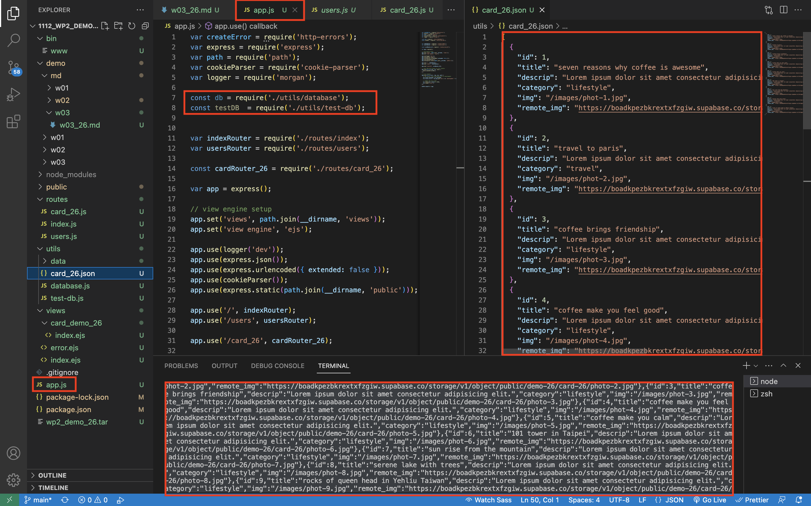
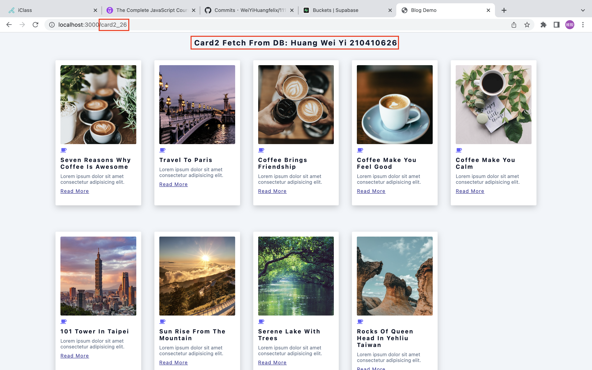
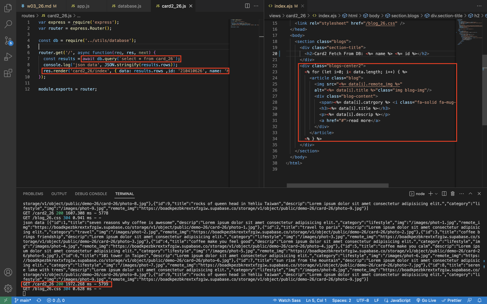

### W03-P1: testDB to get 9 data from card_xx tables


```
7a3d26a WeiYiHuangfelix Thu Mar 2 07:35:11 2023 +0800   W03-P1: testDB to get 9 data from card_xx tables
```

### W03-P2: fetch 9 data from card_xx table and placed in card2_xx/index.ejs


 
